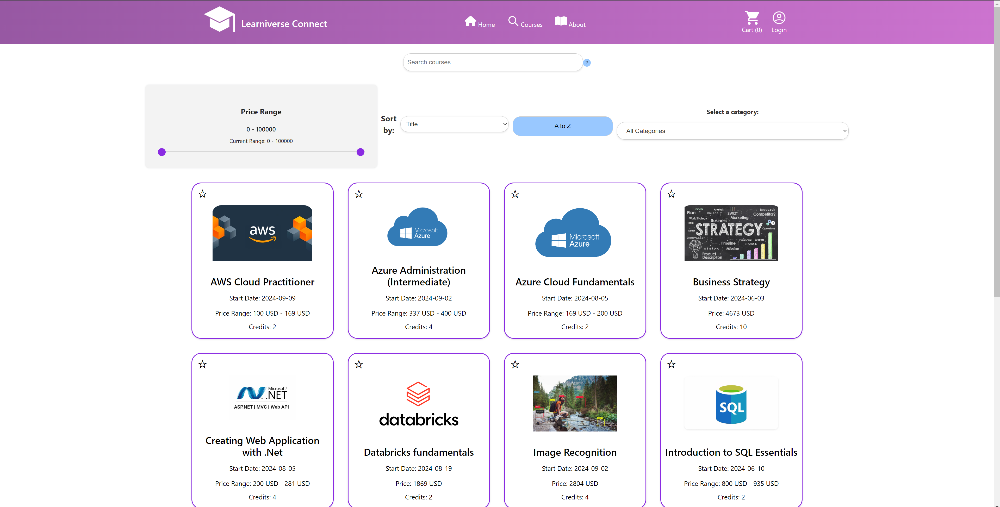

# Learniverse-Connect Frontend

This is the frontend for the website. It is made using React. The user has the ability to add courses to cart, see their favorite courses, get email confirmation on purchase and more.

ADD PICTURE

## Before running frontend

You'll need to have Node.js (npm) installed on your machine. If you dont, you can download it from here [here](https://nodejs.org/en). 

## Running the backend:
1. Enter the git repository folder
2. Change directory to frontend. This can be done using  `cd frontend `
3. Add `.env.local` under the frontend folder. Add `VITE_API_BASE_URL=http://localhost:8080/api` inside of it
3. Install the dependencies:  `npm run build `
4. Run the project using `npm start`